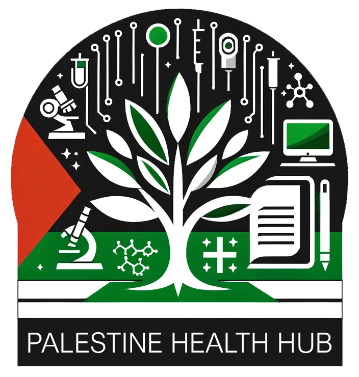

  

# Palestine MedLib

Welcome to the first Palestine Health Hub initiative: **PSmedlib**, a resource repository dedicated to the healthcare system in Palestine. This platform serves as a centralized hub, offering a diverse array of materials such as academic papers, books, reports, and documentaries. These resources focus primarily on war-related healthcare, including healthcare infrastructure, war injuries, technology in healthcare, and psychological trauma.

This repository aims to provide valuable insights for researchers, practitioners, policymakers, and anyone interested in understanding the impact of conflict on the healthcare system in Palestine.

## Resources
### Journal Articles
- [Injuries and Treatments](/resources/injuries_and_treatments.md)
- [Psychological Effects](/resources/psychological_effects.md)
- [Conflict Dynamics and Healthcare](/resources/conflict_dynamics.md)
- [Socio-political Analysis](/resources/socio-political_analysis.md)

### Reports and Books
- [Data & Reports by Global Health & Humanitarian Organizations](/resources/int_reports.md)
- [Books & Essays](/resources/books.md)

## How to Contribute
We warmly welcome contributions from the community! If you possess relevant resources that are currently not featured, or if you want to contribute in other ways, please do not hesitate to contact us. Reach out via email at PalestineHealthHub@gmail.com or submit a merge request directly. Your involvement can make a significant difference!